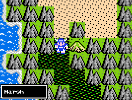
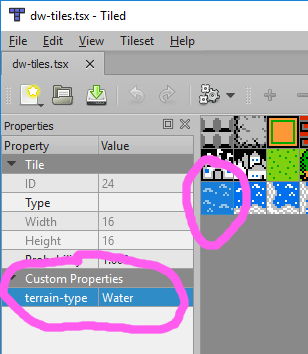

# ST2U_TileProperties

This Unity project demonstrates how to get at custom properties for a given tile at runtime using SuperTiled2Unity.



The project has Erdrick of Dragon Quest fame walking on top of a `Tilemap`. Every frame he checks what "kind" of tile he is over and updates the in-game UI with a custom property value that describes that tile.



Generally, you will need the following data or objects when retrieving data from a tile.

1. A Unity `Tilemap` instance.
2. A `Vector3Int` representing the location on the `Tilemap` you are interested in. You can use the `Tilemap.WorldToCell` to transform a Vector3 in world-space to a cell on your tilemap.
3. A `SuperTiled2Unity.SuperTile` instance. Use `Tilemap.GetTile` to a `TileBase` instance and cast it to a SuperTile.
4. Call an extension method on the `SuperTile` to get the value of a property you want. For example, `SuperTile.GetPropertyValueAsString()`. (There are versions of that method that can get custom property values as a `string`, `float`, `bool`, `enum`, and `Color`.)

In this project, the `PlayerTerrain` class has the code example that should serve as a guide.

```cs
var tilemap = GameObject.FindGameObjectWithTag("TerrainMap").GetComponent<Tilemap>();
var worldPosition = gameObject.transform.position + (Vector3)m_Offset;
var cellPosition = tilemap.WorldToCell(worldPosition);

// Get the tile at the given cell position
if (tilemap.GetTile(cellPosition) is SuperTile tile)
{
    // Report to our UI which tile we're standing on
    var text = GameObject.FindGameObjectWithTag("TileTypeText").GetComponent<TextMeshProUGUI>();
    text.text = tile.GetPropertyValueAsString("terrain-type", "unknown");
}
```

Thanks and good luck with your game.

Sean Barton